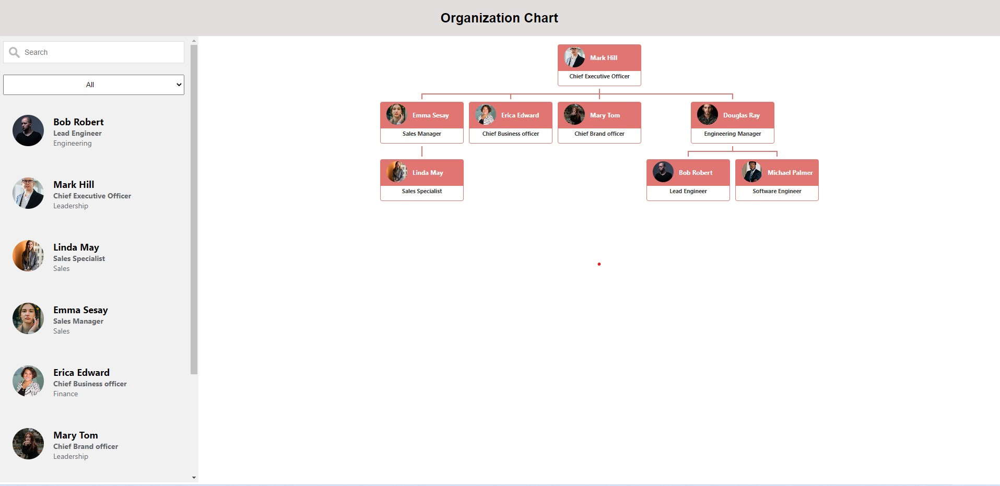

# Employee Organization Chart

This project was bootstrapped with [Create React App](https://github.com/facebook/create-react-app).
This application allows user to visualise and update an employee organization chart 
interactively with drag & drop. 

It is developed using React. Redux is used for state management.

## Backend API
Miragejs is used to mock backend api.
- /api/employees is used to get employee details
- /api/employee/:id is used to update an employee's details. It is a patch request.

## Screenshot on running application

The screenshot shows

## Available Scripts

In the project directory, you can run:

### `npm start`

Runs the app in the development mode.\
Open [http://localhost:3000](http://localhost:3000) to view it in your browser.

The page will reload when you make changes.\
You may also see any lint errors in the console.

### `npm test`

This can be used to run test files
